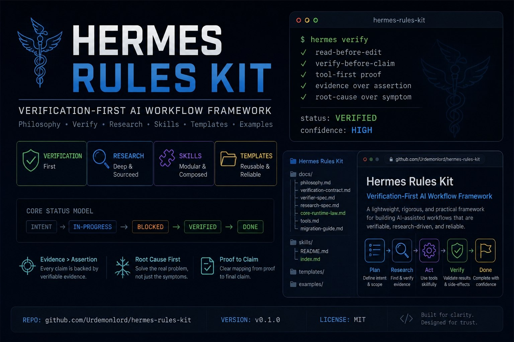

# Hermes Rules Kit

[](https://github.com/Urdemonlord/hermes-rules-kit/releases)
[](./LICENSE)
[](./ROADMAP.md)

Hermes-native execution rules, templates, and skills for grounded coding, verification, research, and multimodal proof.

This is not a persona pack.
This is not motivational prompt fluff.
This is an execution framework for making Hermes more reliable under real tool use.



## What problem this solves

Most agent failures are not intelligence failures. They are operating-discipline failures:
- answering from prose when tools could settle the question
- editing before locating the owner of the behavior
- patching symptoms instead of broken invariants
- claiming success without runtime proof
- letting stale context pollute later decisions
- mixing assumptions across unrelated projects
- trusting side effects that were never directly verified

Hermes already has strong tools.
What it needs is a stricter contract for how those tools turn into action.

Hermes Rules Kit provides that contract.

## What this repo contains

```text
hermes-rules-kit/
├── README.md
├── ROADMAP.md
├── CONTRIBUTING.md
├── assets/
│   ├── social-preview.svg
│   └── social-preview.png
├── docs/
│   ├── philosophy.md
│   ├── core-runtime-law.md
│   ├── architecture.md
│   ├── verification-contract.md
│   ├── hermes-tool-mapping.md
│   ├── verifier-spec.md
│   ├── research-spec.md
│   └── migration-notes.md
├── templates/
│   ├── AGENTS.template.md
│   └── closeout-template.md
├── examples/
│   ├── debugging-closeout.md
│   ├── verification-closeout.md
│   ├── verifier-report.md
│   ├── research-report.md
│   └── project-agnostic-AGENTS.md
└── skills/
    ├── README.md
    ├── index.md
    ├── hermes-agentic-coding-20-80/
    ├── hermes-verifier-mode/
    ├── hermes-deep-research-loop/
    └── hermes-multimodal-proof/
```

## Core ideas

### 1. Inspect before deciding
For non-trivial tasks:
1. define the outcome operationally
2. inspect repo, runtime, and constraints first
3. find the spine: entry points, data flow, state, persistence, user-visible surface
4. prove the smallest vertical slice
5. verify where the user experiences the result
6. expand only after proof

### 2. Reasoning must update after every tool result
Every tool result should change the next move.

Loop:
- observe
- update
- decide

Hard rules:
- explain surprising results before continuing
- do not keep executing a stale plan invalidated by new evidence

### 3. Root cause over symptom
Use this chain:
- symptom
- mechanism
- invariant
- breach
- fix

If the invariant still fails, the bug is not fixed.

### 4. Proof must match the claim
A build pass is not proof of user-visible behavior.
A code diff is not proof of runtime correctness.
A self-report from a subagent is not proof of side effects.

### 5. Context hygiene is a first-class concern
Long context is useful only if low-signal or stale material is compressed or dropped.

### 6. Project isolation is mandatory
Do not carry assumptions, conventions, or deployment habits from project A into project B just because they look similar.

## Quick start

### Option A: use the project template
Copy `templates/AGENTS.template.md` into a repo-level `AGENTS.md`, then adapt only the project-specific parts.

### Option B: use the local skills
If you run Hermes locally, mirror or load the companion skills for:
- coding discipline
- verifier mode
- deep research
- multimodal proof

### Option C: use it as a house standard
Adopt the docs, closeout template, and examples as your default operating model for engineering tasks.

## Recommended path

If you want the 20/80 setup:
1. start with `templates/AGENTS.template.md`
2. read `docs/verification-contract.md`
3. read `docs/hermes-tool-mapping.md`
4. use `examples/verifier-report.md` and `examples/research-report.md` as output shapes
5. adopt mirrored skills as modular overlays

## Who this is for

Use this if you:
- run Hermes as a serious coding, debugging, or research agent
- work across multiple repos or products
- care about verification quality
- want fewer false completions
- need a cleaner operating model for terminal + browser + subagent workflows

## Who this is not for

This is probably overkill if you only want:
- casual brainstorming
- lightweight prompt chat
- persona tuning
- generic inspirational rules with no verification model

## Status model

Preferred status language:
- `changed`
- `verified`
- `unverified`
- `blocked`
- `assumption`
- `multimodal-grounded`

Do not say fixed, working, or done without proof immediately after.

## Design principles

- **Tool-grounded execution** — prefer evidence over plausible text
- **Root-cause engineering** — fix broken invariants, not surface symptoms
- **Proof-based delivery** — separate changed from verified from blocked
- **Context hygiene** — compress aggressively and keep only what remains decision-relevant
- **Hermes-native workflows** — built around `read_file`, `search_files`, `patch`, `terminal`, `browser_*`, `delegate_task`, and `session_search`
- **Modular packaging** — keep the always-on core small and deeper procedures modular

## Repo map

- `docs/philosophy.md` — why the kit exists
- `docs/core-runtime-law.md` — smallest always-on execution contract
- `docs/architecture.md` — how docs, templates, examples, and skills fit together
- `docs/verification-contract.md` — proof language and claim discipline
- `docs/verifier-spec.md` — adversarial validation workflow
- `docs/research-spec.md` — deep research workflow
- `templates/AGENTS.template.md` — default repo-level operating law
- `templates/closeout-template.md` — standard completion summary format
- `examples/` — concrete report and closeout shapes
- `skills/` — public mirror of the local Hermes skill set
- `skills/index.md` — selection guide and comparison overview
- `ROADMAP.md` — version path from v0.1 to broader maturity

## Philosophy

The best agent rule is not the one that sounds smartest.
It is the one that most reliably converts tools into correct action.

That means:
- less persona
- more evidence
- less narration
- more verification
- less context bloat
- more operational clarity

## Release

Current public release target:
- `v0.1.0` — base kit, core docs, templates, examples, and mirrored skills

## Contributing

See [CONTRIBUTING.md](./CONTRIBUTING.md).
The short version:
- sharpen the operating law
- add examples from real failure modes
- avoid fluff, duplication, and runtime assumptions copied from other ecosystems

## License

MIT
